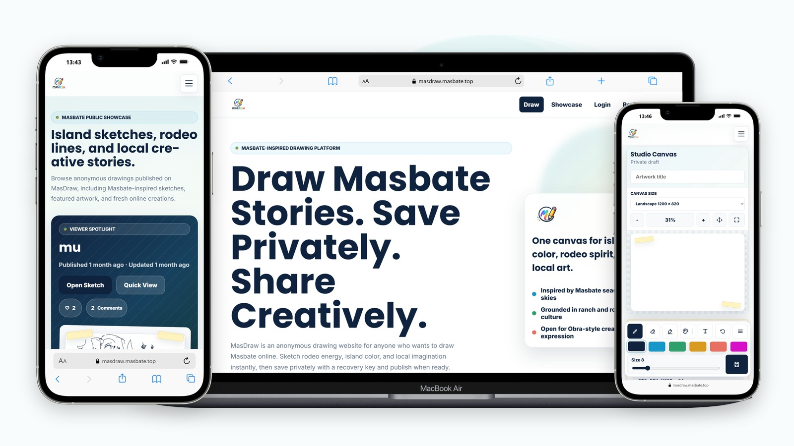
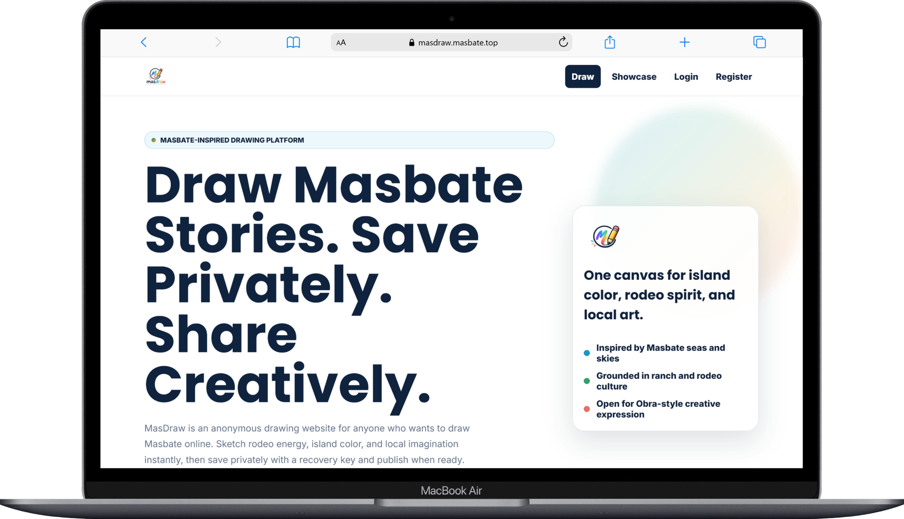
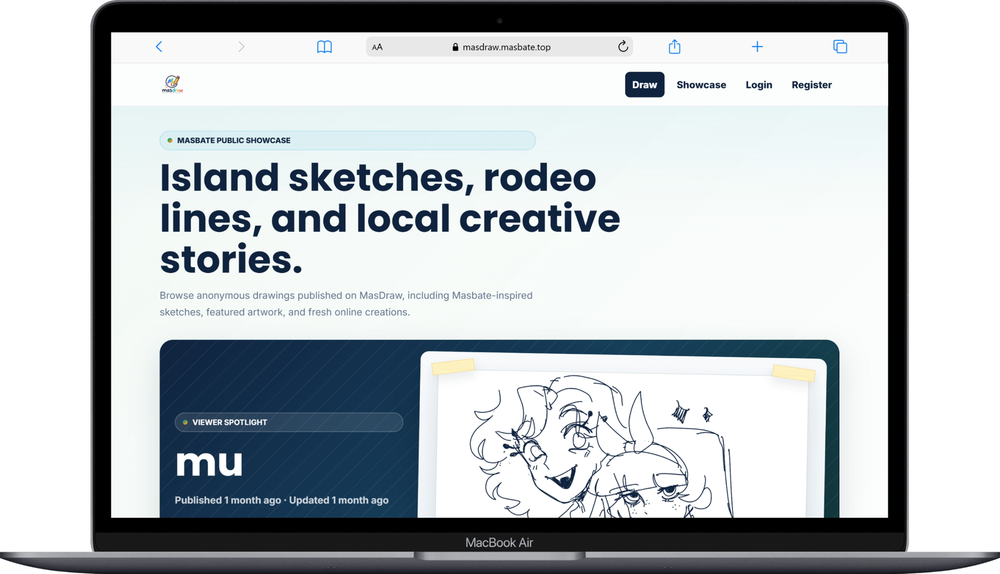
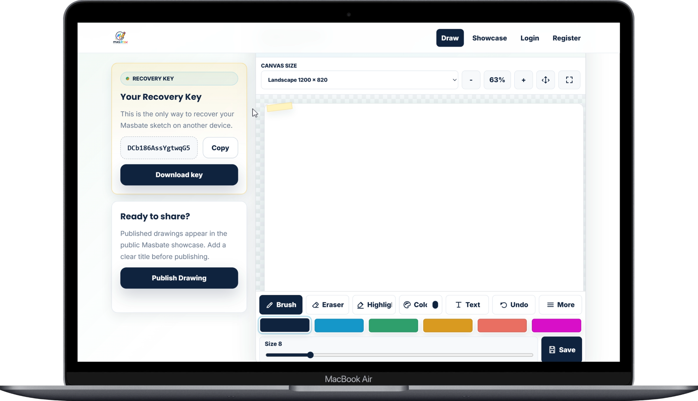
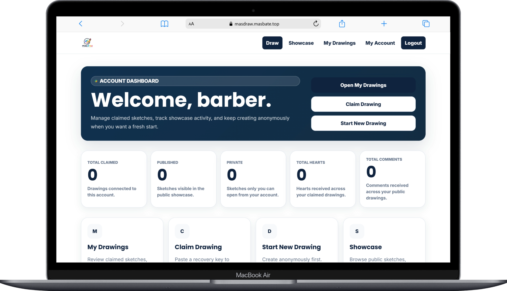
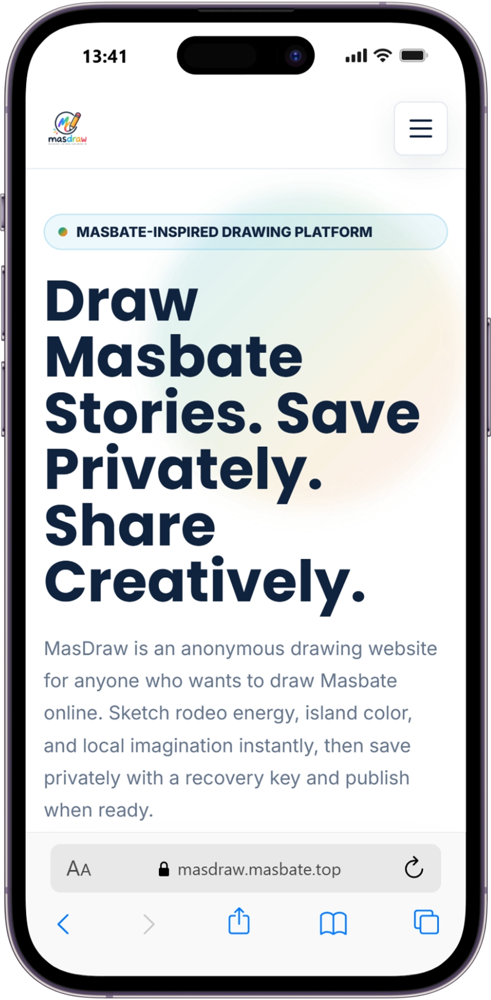
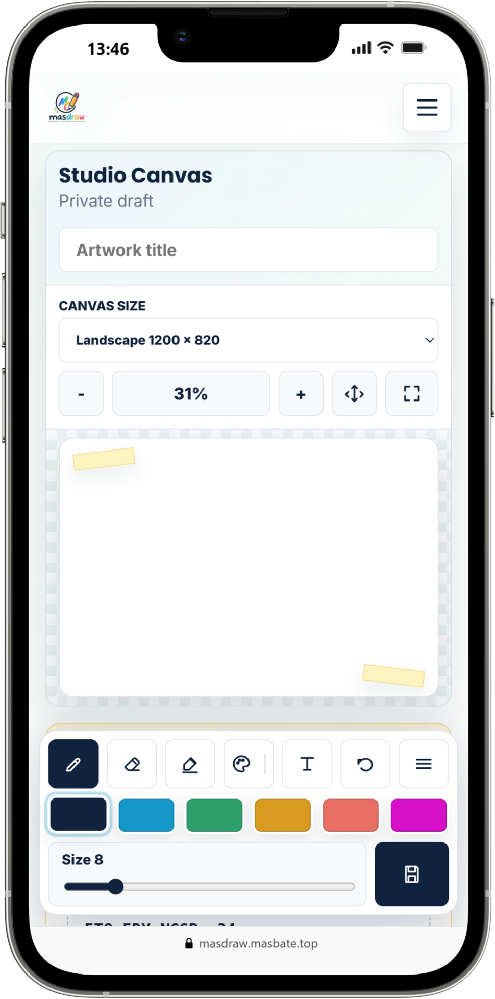
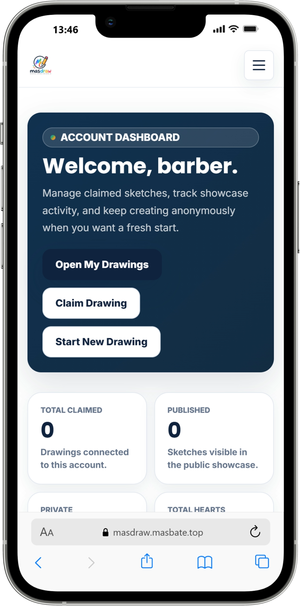

# MasDraw

Anonymous online drawing platform for Masbate-inspired digital sketches, private recovery, and public artwork sharing.

## Project Overview

MasDraw is a Django web application that lets users create browser-based drawings without requiring an account. Users can start a private drawing session, save their work with a recovery key, and publish finished artwork to a public showcase when they are ready.

The project is built around a simple local creative use case: give students, hobbyists, and Masbate-based creators a fast way to draw online, keep sketches private, and share selected artwork publicly.

## Problem It Solves

Many lightweight drawing tools add friction through account creation, app installation, complex interfaces, or public identity requirements. MasDraw removes that friction by providing:

- No-signup drawing creation
- Private recovery through a generated key
- Optional account registration for claiming drawings
- A public showcase for finished artwork
- SEO-focused public pages for local discovery

This makes the product useful for casual drawing, school activities, community art prompts, and anonymous creative expression.

## Key Features

- Anonymous drawing sessions with generated recovery keys
- Recovery key hashing using Django password hash utilities
- Browser token support for reopening recent drawings
- Canvas drawing tools: brush, eraser, highlighter, text, move text, line, rectangle, circle, fill, undo, clear, symmetry, zoom, pan, fullscreen, and canvas size options
- Manual save and autosave behavior for drawing data and preview images
- Public publishing workflow that requires a saved preview and non-empty title
- Public showcase with featured drawings, latest drawings, top-hearted drawings, quick preview, pagination, and detail pages
- Optional user accounts using Django authentication
- Claim drawing flow that links anonymous drawings to a logged-in account using the recovery key
- Account dashboard, my drawings page, drawing filters, and profile picture selection from saved artwork
- Logged-in showcase interactions with hearts and comments
- Comment soft-delete behavior and admin moderation actions
- Admin tools for publishing, unpublishing, featuring, unfeaturing, hiding comments, and unhiding comments
- SEO support through metadata, canonical URLs, sitemap, robots.txt, Open Graph, Twitter cards, and structured data
- Basic abuse protection through CSRF protection, POST-only mutation routes, and rate limits for drawing creation, claim attempts, hearts, and comments

## Screenshots / Demo

<p align="center">
  
</p>

MasDraw includes a responsive anonymous drawing workflow, public artwork showcase, and optional account dashboard for claimed drawings.

| Landing / SEO Page | Public Showcase |
|---|---|
|  |  |

| Drawing Studio | Account Dashboard |
|---|---|
|  |  |

| Mobile Landing | Mobile Drawing Studio | Mobile Dashboard |
|---|---|---|
|  |  |  |

## My Role

I designed and developed the project, including the Django backend, database models, anonymous drawing workflow, account and recovery flows, frontend canvas integration, public showcase, SEO pages, admin moderation tools, and deployment preparation.

## Tech Stack

| Area | Technology |
|---|---|
| Backend | Python, Django |
| Frontend | Django Templates, HTML, CSS, JavaScript |
| Drawing Interface | HTML Canvas API |
| Database | SQLite by default, PostgreSQL configurable in settings |
| Authentication | Django Authentication |
| Admin | Django Admin |
| Static Files | Django Staticfiles, WhiteNoise middleware when installed |
| SEO | Django Sitemap Framework, robots.txt, structured data, Open Graph, Twitter cards |
| Testing | Django TestCase |
| Configuration | Environment variables loaded through `python-decouple` style config |

## Skills Demonstrated

- Full-stack web development with Django
- Server-rendered frontend development
- Database modeling and relational data design
- Authentication and authorization
- Anonymous session and recovery-key design
- CRUD-style drawing persistence
- Canvas-based frontend state management
- JSON request handling and API-style Django views
- CSRF protection and secure POST handling
- Rate limiting with Django cache
- Public/private content visibility rules
- Admin moderation tooling
- SEO-focused web application structure
- Static asset management
- Automated backend testing
- Deployment preparation for a production Django app

## System Workflow

Anonymous drawing flow:

User opens MasDraw  
->  
Starts a drawing without signing up  
->  
System creates an anonymous session and drawing project  
->  
User receives a recovery key  
->  
Canvas saves drawing JSON and preview image  
->  
User can keep the drawing private or publish it  
->  
Published drawings appear in the public showcase

Account claiming flow:

User registers or logs in  
->  
Submits a recovery key  
->  
System verifies the hashed key against active anonymous sessions  
->  
Matching drawings are assigned to the account  
->  
User manages claimed drawings from the account dashboard

Showcase interaction flow:

Visitor opens the showcase  
->  
System displays featured, latest, and top-hearted published drawings  
->  
Logged-in users can heart or comment on published drawings  
->  
Admin can moderate drawings and comments from Django Admin

## Project Structure

```text
masdraw/
+-- base/
|   +-- admin.py              # Django admin registrations and moderation actions
|   +-- models.py             # Anonymous sessions, drawings, profiles, hearts, comments
|   +-- sitemaps.py           # Static and published drawing sitemap entries
|   +-- tests.py              # Backend tests for SEO, accounts, claims, comments, hearts, moderation
|   +-- urls.py               # App route definitions
|   +-- views.py              # Page views, drawing save/publish logic, auth flows, showcase logic
+-- docs/
|   +-- PHASE-1-PRODUCT-DESCRIPTIONS.txt
|   +-- PHASE-1-TECHNICAL-DESCRIPTIONS.txt
+-- masdraw/
|   +-- settings.py           # Django settings and environment-driven database config
|   +-- urls.py               # Project routes, admin route, sitemap, robots, favicon
|   +-- asgi.py
|   +-- wsgi.py
+-- static/
|   +-- assets/               # Logo and brand assets
|   +-- css/                  # Page and feature styles
|   +-- js/                   # Canvas, account, showcase, and dashboard scripts
+-- templates/
|   +-- account/              # Account dashboard, auth, claim, and profile templates
|   +-- base.html             # Shared layout, navigation, metadata, auth modal
|   +-- draw.html             # Drawing canvas page
|   +-- showcase.html         # Public artwork gallery
|   +-- showcase_detail.html  # Published artwork detail page
+-- manage.py
+-- requirements.txt
+-- README.md
```

## Installation and Setup

1. Clone the repository:

```bash
git clone https://github.com/yourusername/masdraw.git
cd masdraw
```

2. Create and activate a virtual environment:

```bash
python -m venv .venv
```

Windows PowerShell:

```powershell
.\.venv\Scripts\Activate.ps1
```

macOS/Linux:

```bash
source .venv/bin/activate
```

3. Install dependencies:

```bash
pip install -r requirements.txt
```

The current settings file imports `decouple.config`. If `python-decouple` is not already included in the installed dependencies, install it:

```bash
pip install python-decouple
```

4. Create a local `.env` file:

```env
DEBUG=True
PRIMARY_DOMAIN=localhost
DATABASE=sqlite3
```

5. Create migrations if migration files are not present, then apply database migrations:

```bash
python manage.py makemigrations base
python manage.py migrate
```

6. Create an admin user:

```bash
python manage.py createsuperuser
```

7. Start the development server:

```bash
python manage.py runserver
```

8. Open the project locally:

```text
http://127.0.0.1:8000/
```

Admin panel:

```text
http://127.0.0.1:8000/3/admin/
```

## Environment Variables

No `.env.example` file is currently included. A safe local example is:

```env
DEBUG=True
PRIMARY_DOMAIN=localhost
DATABASE=sqlite3
```

Optional PostgreSQL configuration supported by `settings.py`:

```env
DEBUG=False
PRIMARY_DOMAIN=masdraw.example.com
DATABASE=postgres
DATABASE_NAME=masdraw
DATABASE_USER=masdraw_user
DATABASE_PASSWORD=change-this-password
DATABASE_HOST=localhost
DATABASE_PORT=5432
```

Do not commit real secrets, production passwords, or private environment files.

## Usage

After starting the development server:

1. Visit the home page.
2. Click **Draw** to create an anonymous drawing session.
3. Save the generated recovery key.
4. Use the canvas tools to create a drawing.
5. Save the drawing manually or wait for autosave.
6. Add a title before publishing.
7. Publish the drawing to make it visible in the showcase.
8. Optionally create an account and claim anonymous drawings with the recovery key.
9. Use the Django admin panel to manage published drawings, featured artwork, and comments.

## Future Improvements

- Move the hardcoded Django `SECRET_KEY` into environment configuration
- Add and commit proper migration files instead of generating them during setup
- Add a `.env.example` file for safer onboarding
- Add PostgreSQL as the default production database
- Move preview images from base64 database storage to object storage
- Add explicit payload size validation for saved drawing data and preview images
- Improve recovery-key lookup performance for larger datasets
- Add a moderation queue before drawings appear publicly
- Add user-facing delete and unpublish controls
- Add download/export options directly from the drawing editor
- Add analytics for started drawings, saves, publishes, claims, hearts, and comments
- Add health check and production deployment documentation

## What I Learned

Building MasDraw strengthened my experience with Django application architecture, anonymous user workflows, secure recovery-key handling, canvas-based frontend state, public/private content rules, admin moderation, SEO implementation, and practical MVP tradeoffs. It also showed how a focused local product can use simple technology to validate demand before adding heavier infrastructure.

## Author

**Your Name**  
GitHub: https://github.com/yourusername  
Portfolio: https://yourportfolio.com  
Email: your-email@example.com
"# masdraw" 
